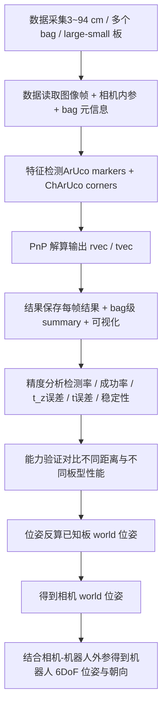

### 1. 目标
本方案用于评估基于相机观测 ArUco/ChArUco 标定板并通过 PnP 进行位姿解算的精度与稳定性。  
项目重点覆盖以下内容：

1. 采集 `3 cm ~ 94 cm` 不同距离下的数据。
2. 覆盖不同 `bag`、不同尺寸标定板（大板/小板）。
3. 完成从原始图像到检测、PnP 解算、结果保存、误差统计、可视化分析的全流程。
4. 说明 PnP 内部求解内容与坐标解算关系。
5. 验证在已知板子世界坐标的前提下，是否可以进一步反算机器人相机的 `6DoF` 位置与朝向。

---

## 2. 数据采集方案

### 2.1 采集对象
采集对象为相机观察固定放置的 ArUco/ChArUco 板时的图像序列或 rosbag/mcap 数据，需包含：

- 相机图像
- 相机内参信息
- 标定板类型信息
- 每次采集对应的真实距离标签

### 2.2 距离范围
本项目采集距离覆盖：

- 近距离段：`3 cm ~ 36 cm`，按 `3 cm` 递增采集
- 远距离补充点：`94 cm`

即覆盖如下典型距离点：

`3, 6, 9, 12, 15, 18, 21, 24, 27, 30, 33, 36, 94 cm`

### 2.3 标定板类型
至少包含两种尺寸板：

- 大标定板 `large`
- 小标定板 `small`

这样可以评估板尺寸对检测率、PnP 成功率、位姿精度和稳定性的影响。

### 2.4 bag 组织方式
每个距离、每种板型建议采集多个 bag，以减小偶然误差影响。  
推荐组织原则：

- 同一距离 + 同一板型，采集 `2~4` 个 bag
- 每个 bag 保持一段稳定观测过程
- bag 命名中保留时间戳或序号，便于追踪

建议每个 bag 关联如下元信息：

- `bag_name`
- `board_size`
- `gt_distance_cm`
- `camera_frame_id`
- `采集时间`
- `环境备注`（光照、反光、遮挡、角度等）

### 2.5 采集注意事项
为保证结论可信，采集时应尽量控制变量：

- 尽量固定相机姿态
- 标定板尽量正对相机，同时可补充少量倾斜样本
- 避免强反光、过曝、严重运动模糊
- 每次采集保持板在画面内稳定出现
- 确保相机内参已知且正确
- 若板在机器人应用中有固定安装方式，采集时尽量贴近真实使用姿态

---

## 3. 数据处理流程

### 3.1 总体流程
每个 bag 的处理流程如下：

1. 读取图像帧与相机内参
2. 根据 bag 元信息确定板型（大板/小板）
3. 在每帧图像中检测 ArUco marker
4. 插值恢复 ChArUco 角点
5. 使用角点和相机内参执行 PnP 位姿估计
6. 保存每帧检测结果与位姿结果
7. 统计每个 bag 的平均误差、成功率、稳定性指标
8. 汇总所有 bag，形成距离维度和板型维度的对比分析

### 3.2 每帧处理内容
每帧主要输出以下信息：

- `markers_detected`：检测到的 marker 数量
- `charuco_corners`：恢复出的 ChArUco 角点数量
- `pnp_success`：PnP 是否成功
- `rvec`：旋转向量
- `tvec`：平移向量
- `t_x, t_y, t_z`
- `|t|`：平移向量模长
- `reproj_rmse_px`：重投影误差
- 可视化结果图（marker、角点、坐标轴）

### 3.3 bag 级统计内容
对每个 bag 汇总：

- 总帧数
- marker 平均检出数
- ChArUco 角点平均数量
- PnP 成功帧数 / 失败帧数
- PnP 成功率
- `t_z` 均值、标准差
- `|t|` 均值、标准差
- 与 GT 距离的绝对误差
- 重投影误差均值
- 位姿帧间离散度

---

## 4. 精度分析流程

### 4.1 分析目标
精度分析主要回答以下问题：

1. 不同距离下，PnP 是否稳定可用？
2. 大板和小板的检测率、成功率、精度差异如何？
3. 误差随距离变化是否呈现明显趋势？
4. 位姿估计误差主要来自检测失败、角点不足，还是几何退化？
5. 是否能够支撑后续机器人 6DoF 反算需求？

### 4.2 建议分析维度

#### 4.2.1 检测能力分析
关注：

- marker 检出率
- ChArUco 角点数量
- PnP 成功率

分析目的：

- 判断某个距离/某块板是否“看得见”
- 判断可用于解算的帧比例是否足够高

#### 4.2.2 距离精度分析
重点指标：

- `t_z` 与 GT 距离的误差
- `|t|` 与 GT 距离的误差

可输出：

- 误差均值
- 误差标准差
- 按距离散点图/均值曲线图

说明：

- `t_z` 更接近“沿光轴方向”的距离估计
- `|t|` 是板原点到相机光心的三维直线距离

#### 4.2.3 横向/纵向误差分析
可进一步观察：

- `t_x`
- `t_y`
- `t_z`

意义：

- 看看误差主要集中在哪个方向
- 判断是否存在系统性偏移，例如某个轴始终偏大或偏小

#### 4.2.4 内部稳定性分析
重点指标：

- 重投影 RMSE
- 同一 bag 内 `t_x/t_y/t_z/|t|` 的标准差
- 位姿散度 RMS

意义：

- 衡量同一静态场景下的帧间抖动
- 判断系统是否稳定，而不只是“平均上接近 GT”

#### 4.2.5 大板 vs 小板对比
重点对比：

- 检出率
- PnP 成功率
- 距离误差
- 位姿稳定性

预期结论通常是：

- 大板在中远距离更容易检测，PnP 更稳定
- 小板在近距离可能足够，但距离拉远后性能更易下降

---

## 5. PnP 内部做了什么

### 5.1 输入是什么
PnP 的输入本质上是：

- 板上已知的 `3D 点`，这些点定义在标定板自身坐标系中
- 图像中检测到的这些点对应的 `2D 像素坐标`
- 相机内参 `K`
- 畸变参数 `D`

在本项目中，3D 点来自 ChArUco 板模型，2D 点来自图像中的插值角点。

### 5.2 解算目标是什么
PnP 要求解的是一个刚体变换：

\[
P_{camera} = R \cdot P_{board} + t
\]

其中：

- `P_board`：板坐标系下的三维点
- `P_camera`：相机坐标系下的三维点
- `R`：板到相机的旋转
- `t`：板到相机的平移

因此 PnP 输出的是：

- `rvec`：旋转向量，可转成旋转矩阵 `R`
- `tvec`：平移向量 `t`

### 5.3 这意味着什么
这里得到的不是“单纯一个距离”，而是**板相对于相机的完整 6DoF 位姿**。

具体来说：

- `tvec` 给出了板坐标系原点在相机坐标系下的位置
- `rvec` 给出了板坐标系相对于相机坐标系的朝向

注意：

- 板坐标原点通常是板模型定义的一个角点，不一定是板中心
- 板法向只是姿态中的一部分，完整姿态还包括绕法向的旋转

### 5.4 项目里为何常看 `t_z` 和 `|t|`
因为本项目当前重点是距离评估，所以常使用：

- `t_z`：板原点在相机光轴方向上的距离分量
- `|t|`：板原点到相机的欧式距离

这两个量可以用来和真实测量距离做比较，但它们只是完整位姿中的一部分。

---

## 6. 坐标解算过程说明

### 6.1 当前直接得到的坐标关系
PnP 直接求出的是：

**板坐标系 -> 相机坐标系**

即：

\[
T_{camera \leftarrow board}
\]

这是“板在相机眼里”的位姿。

### 6.2 若已知板子在世界坐标中的固定位置
若板子在世界坐标系中位置固定，并且已知：

\[
T_{world \leftarrow board}
\]

则可以反推出相机在世界坐标系中的位姿：

\[
T_{world \leftarrow camera}
=
T_{world \leftarrow board}
\cdot
T_{board \leftarrow camera}
\]

而

\[
T_{board \leftarrow camera}
=
(T_{camera \leftarrow board})^{-1}
\]

所以最终：

\[
T_{world \leftarrow camera}
=
T_{world \leftarrow board}
\cdot
(T_{camera \leftarrow board})^{-1}
\]

### 6.3 再进一步得到机器人 6DoF
如果相机刚性安装在机器人上，并且已知相机相对机器人本体的外参：

\[
T_{robot \leftarrow camera}
\]

那么可以进一步得到机器人在世界坐标系中的位姿：

\[
T_{world \leftarrow robot}
=
T_{world \leftarrow camera}
\cdot
T_{camera \leftarrow robot}
\]

或者按你系统中的变换定义写成等价形式。

这就说明：

**在已知板子世界坐标、并已知相机与机器人之间外参的前提下，可以通过 PnP 反推出机器人完整 6DoF 位置与朝向。**

---

## 7. 本项目可支持的最终能力

基于当前这套数据和流程，可以完成以下能力验证：

1. 在不同距离下，验证 ChArUco + PnP 是否能稳定输出板相对相机的位姿。
2. 对比不同尺寸板在检测成功率和解算精度上的差异。
3. 用真实距离标签评估 `t_z` 和 `|t|` 的误差水平。
4. 用重投影误差和帧间位姿散度评估内部稳定性。
5. 在板子世界坐标已知时，将“板相对相机位姿”转换为“相机相对世界位姿”。
6. 在相机与机器人外参已知时，进一步得到机器人在世界坐标系下的 `6DoF` 位姿与朝向。

---

## 8. 方案结论

本项目不是只做“测距”，而是在完成一个完整的视觉位姿解算流程。  
通过检测 ChArUco 板角点并执行 PnP，可得到标定板相对于相机坐标系的完整 `6DoF` 位姿；在此基础上，结合已知的板子世界坐标和机器人相机外参，就能够反推出机器人在世界坐标系中的位置和朝向。

因此，这套方案既可以用于：

- 不同距离条件下的检测与精度评估

也可以进一步扩展到：

- 基于固定参考板的机器人视觉定位与姿态估计

---

如果你愿意，我下一步可以直接把这份内容整理成更正式的两种版本之一：

1. `实验方案文档版`，适合汇报/评审  
2. `README操作流程版`，适合直接放进项目里

